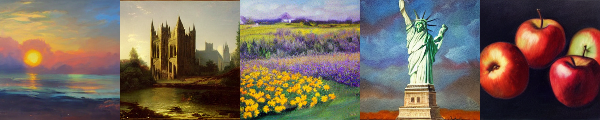
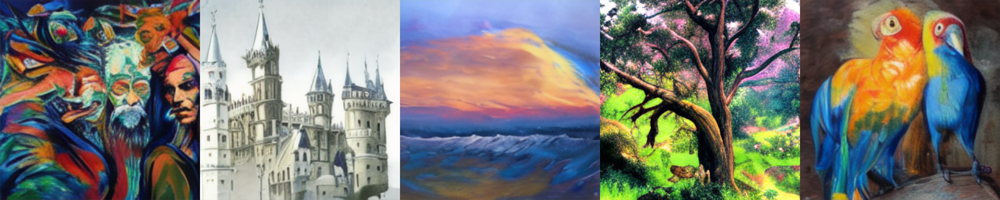
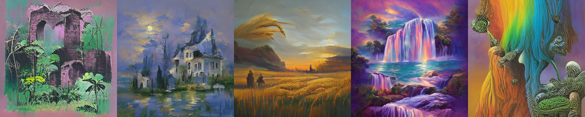
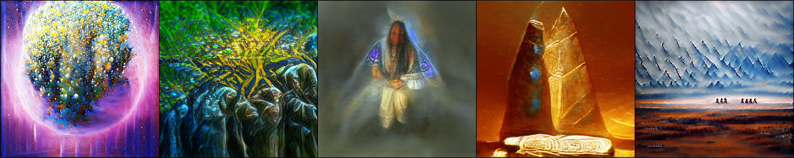

# creative-tools


## Installation
```bash
git clone git@github.com:Liberty3000/creative-tools.git
cd creative-tools/
virtualenv env .
source env/bin/activate
pip install -r requirements.txt
pip install -e .
```

## Toolkit

### `t2i` text-to-image generation

An extensible command line utility for text-to-image creation, animation and enhancement.

##### Latent Diffusion

Diffusion-based image synthesis with [Latent Diffusion](https://github.com/CompVis/latent-diffusion).

```bash
python -m t2i.latent_diffusion --prompt=$PROMPT
```



##### Guided Diffusion

CLIP-guided image synthesis with [Diffusion Models](https://github.com/crowsonkb/guided-diffusion).

```bash
python -m t2i.guided_diffusion --prompt=$PROMPT
```


##### ruDALL-E

Autoregressive image synthesis with 🇷🇺 [DALL-E](https://github.com/ai-forever/ru-dalle).

```bash
python -m t2i.rudalle  --prompt=$PROMPT
```



#### VQLIPSE

CLIP-guided image synthesis with [VQGAN](https://github.com/CompVis/taming-transformers).

```bash
python -m t2i.vqlipse --prompt=$PROMPT
```



#### BigSleep

CLIP-guided image synthesis with [BigGAN](https://github.com/huggingface/pytorch-pretrained-BigGAN).

```bash
python -m t2i.bigsleep --prompt=$PROMPT
```


